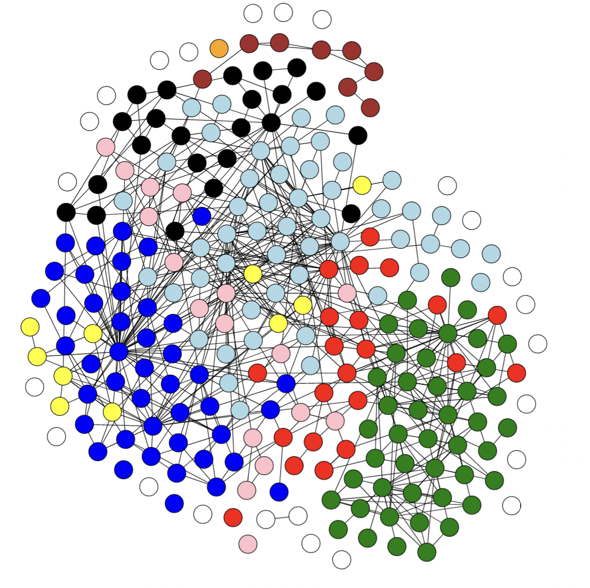

## Objectives
- Making progress on finishing the final report
  - This week my objectives are less learning-focused and more task-focused. The items on the agenda for this week are completing a rough draft of my final report and creating a conference-esque presentation on my final report. George and I talked about potentially turning my final report into a manuscript and ways to archive my work in the case that I don't. I still haven't decided one way or the other whether I'd like to turn my report into a manuscript or not. I think it may depend on the time I have available this next year as I complete the Masters program in CS here at UIUC. However, I'd like to archive my data and code at the very least. The easiest option is to host it here, but there are options to consider. George suggested looking into [PubPub](https://www.pubpub.org/) if I choose not to publish my work in a journal. 

- Some more figures that I made
  - This is a network graph showing publications that cite Paul et al. (1963) from 1964 to 1974. The nodes are color-coded by topic and the graph shows that popular topics at the time include serum cholesterol (blue), blood pressure (light blue), and caffeine (green). An interactive version of this graph can be found [here](https://el-wittmer.github.io/CS597_2022/Impact_Assessment/Network_Graphs/1964-1974.html). 

- For a different project, I made a website with a very basic analysis of the Paul et al. (1963) network over the first three years of publication. That project can be found [here](https://el-wittmer.github.io/Paul_1963). This project shows the expansion of the network and the connections formed in the first few years of Paul et al.'s publication.

[My presentation can be found here](../files/finalreport.pdf)

## Other

I think this is the part of the project that I'm most comfortable with -- the writing part. My final report is a lot of work to write, certainly, but I'm comfortable with writing. I suspect this will be a strength of mine to lean on as I become more involved with the world of CS. The hard part of research was finding a topic I thought was interesting enough to write about. Now that I've found one, the process is fairly straightforward. 
